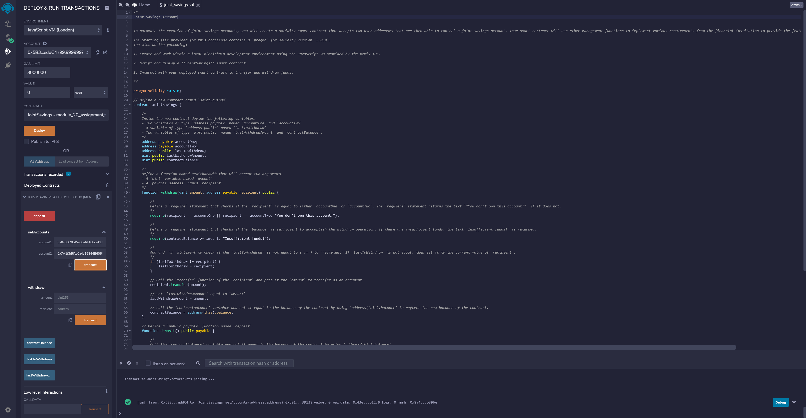
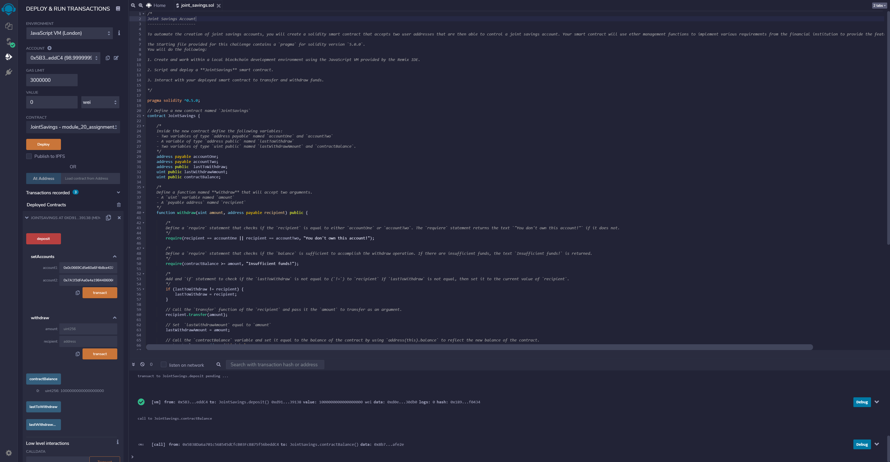
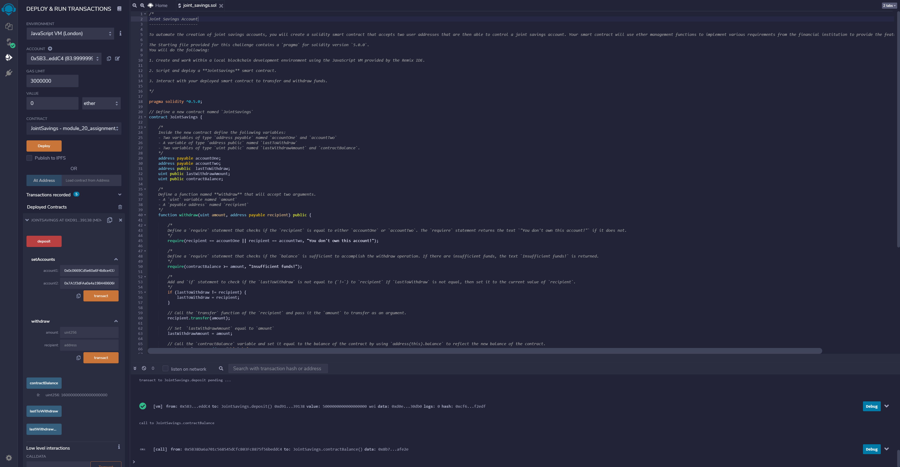
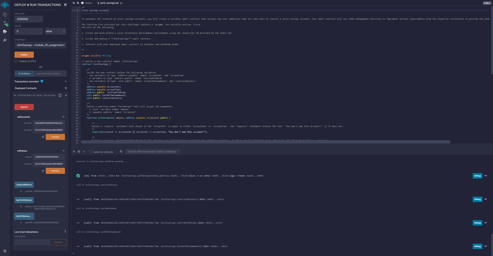

# Fintech-joint-savings

A Solidty based approach, using contracts, arguments, and functions, to create a joint savings account between two addresses capable of receiving deposits and performing withdraws.

Coding begins with creating our contract JointSavings, that will house our variables accountOne (address payable), accountTwo (address payable), lastToWithdraw (address public), lastWithdrawAmount (uint public), and contractBalance (uint public).

Our first function will be withdraw, that will perform a check to determine that the recipient of an action is the previously defined accountOne or accountTwo. Failure in this situation will give the message "You don't own this account!".

Adding to that, we need to ensure that the contractBalance either exceeds or is at least equal to the amount to be used for a transaction. Failure in this situation will give the message "Insufficient funds!".

Furthermore, in the case that the lastToWithdraw didn’t equal to the recipient, we will set it equal to.

To ensure payments, or transfers, succeed, we input recipient.transfer(amount) and lastWithdrawAmount = amount.

To reflect a change in balance for transfers, we use address(this).balance.

Our second function, deposit, is fairly simple enough, reiterating the address(this).balance in the previous function.

To ensure the account functions work properly, we’ll set accountOne equal to account1 & accountTwo equal to account2.

Rounding off our coding, we’ll create a default to store Ethereum deposits using function() external payable {}.

To test our joint account project, we need to start off by setting up our account1 and account2 that will later serve for deposits / withdraws.

After entering our test accounts, we hit the transact button and review the network feed to confirm the setAccounts action was successful.

To help further test the functionality of our coding, we are going deposit funding into our accounts and see if we can validate if the transaction was successful.

We will be depositing 1 Ether as Wei (which is 1,000,000,000,000,000,000 units) and confirming the deposit by reviewing the contractBalance function / feed.

Deciding to up the ante, we will increase our deposit amount from 1 ether to 10 ether.

This time, instead of depositing in the unit of Wei, we will instead defer to Ether, opting to deposit 5 Ether into our accounts.

In a reverse course of action from what we have been doing so far, we will now attempt to withdraw funds from our test account1 and account2.

We will start by focusing on account1 and withdrawing 5 Ethereum (displayed as 5,000,000,000,000,000,000 Wei in the amount box) and validate the transfer as being successful by reviewing the contractBalance, lastToWithdraw, and lastWithdrawAmount functions / feed.

Finally, we end by executing a withdraw from our account2 for the amount of 10 Ethereum, verifying the result by once again reviewing the contractBalance, lastToWithdraw, and lastWithdrawAmount.

---

## Technologies

This exercise runs on pragma solidity 0.5.0, on the following:

* [Remix Ethereum](https://remix.ethereum.org/) – Open source web app for Ethereum contract development, testing, and rollout

---

## Contributors

Santiago Rosas
